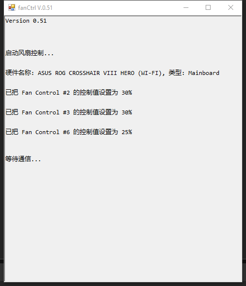
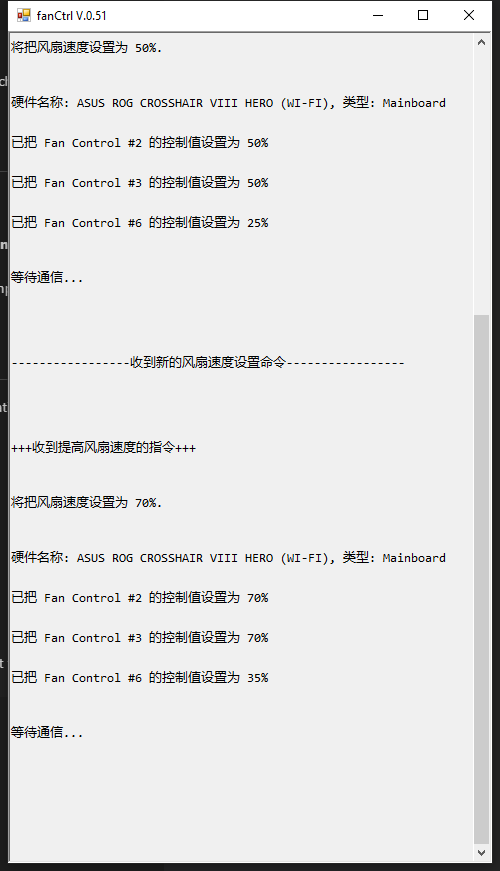

# fanCtrl

A C# program for controlling computer fan speed (Hardware).

## Rebuild Plan 06/28/2025
### Step-by-Step Plan

#### 1. Develop the Frontend UI
- Rewrite the frontend interface using JavaScript.
- Build a fan control UI, such as displaying current speed and control buttons.
- Package and generate static frontend assets.

#### 2. Bridge Electron and C# Backend
- Use Node.js child processes or named pipes to invoke fanctrl.exe.
- Read and display the output from fanctrl.exe for logging purposes.

#### 3. Create a Secure API Interface
- Use `preload.js` to expose backend methods to the frontend.
- Use Electron's IPC communication mechanism for data exchange.

#### 4. Integrate Backend Logic into Frontend
- Trigger fanctrl logic via frontend controls (e.g., buttons).
- Dynamically update the UI to reflect success or failure feedback.

#### 5. Package the Desktop Application

#### 6. Other Key Improvements
- Show notifications in the bottom right corner upon successful speed adjustments to enhance user feedback.
- Enable application auto-start on system boot.
- Restart automatically if the program crashes.
- Optimize the core logic of the software.

## Implementation Principle:
Initially, the plan was to use WMI for adjustments, but the WMI interface only provided monitoring capabilities without modification features. Therefore, OpenHardwareMonitorLib.dll is currently used as the interface, offering a range of commands for monitoring and adjusting hardware at a low level. To avoid issues with multiple instances running concurrently, the Mutex class is employed to ensure that only one instance of the program is running. Mutex is a synchronization primitive used to coordinate multiple threads' access to a shared resource.

The program tries to create a global mutex named "Global\\OHWM_FanControl" when it runs. If the program is the first to attempt creating this mutex (i.e., `createdNew` is `true`), it gains initial ownership of the mutex and can continue executing. If an instance is already running (`createdNew` is `false`), the program outputs a message and exits. Running the program again will prompt the existing instance to adjust the fan speed. Any input in the main instance interface will close the main instance.

### V0.51
The original program, written in C#, requires **administrative rights** to take control of the fan. Two instances were created to send acceleration and deceleration signals, but these also required administrative rights to operate.

To avoid constant UAC prompts for administrative permission when sending signals, Task Scheduler is used to bypass the UAC prompts. (Currently, users need to manually create tasks named **fanSlow** and **fanFast** in the Task Manager.)

The two C# programs in the function folder respectively trigger the fanSlow and fanFast tasks in the system. In theory, there is no need to write .exe files, as .vbs files could suffice. The main reason for creating .exe files is to allow third-party programs to assign shortcuts to run these executables, which is not feasible with .vbs scripts.

### V0.51.1
Added functionality to control the speed of the water pump. The default is 25% (0.9L/min), and when the fan speed reaches above 70%, the water pump speed is adjusted to 35% (1.1L/min).

## Precautions:
- Files must be deployed on a local disk as **network-connected disks cannot initiate administrative rights**.
- At least one main instance must be running to maintain the adjustment of fan speed.
- Due to the involvement of hardware device performance and administrative rights operations, please ensure to **enable administrative rights** or run the program as an administrator, otherwise, errors will occur.
- Manual operations are still needed after deployment to complete the automation setup. If time permits, future improvements will aim for a one-click lazy deployment.

## Interface
- Start   
  
- After some commands executed  
  

## Steps:
Compilation needs to be done using the VS command line:
`csc /out:fanSpeedFast.exe fanSpeedFast.cs`
Alternatively, use the `dotnet build` and `publish` commands to generate executable files for fast.exe or slow.exe.

### Reducing Intrusiveness During Use
- #### Using Task Scheduler to bypass UAC prompts:
    - [How to Create an Elevated Program Shortcut without a UAC Prompt in Windows](https://www.sevenforums.com/tutorials/11949-elevated-program-shortcut-without-uac-prompt-create.html)
    - [How To Add Program To UAC Exception In Windows 10?](https://silicophilic.com/add-program-to-uac-exception/)
- #### Using vbs scripts to execute task commands.
> Q: Why not use PowerShell, Shortcut, or cmd?
I personally tried all three and they would pop up a window briefly, but theoretically, it should be avoidable. However, vbs is simpler, so I used it.

### Acknowledgements:
Thanks to all the open-source developers and the creators and maintainers of OpenHardwareMonitor.
- [OpenHardwareMonitor](https://github.com/openhardwaremonitor/openhardwaremonitor)
- [The Open Hardware Monitor WMI Provider](https://openhardwaremonitor.org/wordpress/wp-content/uploads/2011/04/OpenHardwareMonitor-WMI.pdf)

### [中文说明](README_CN.md)